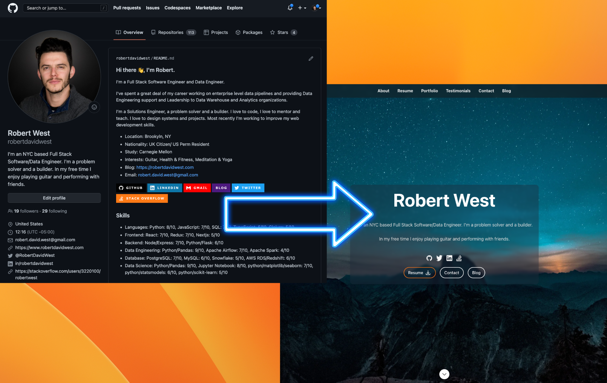

# Github Portfolio

Turn your Github Profile into a beautifully rendered Portfolio website in minutes for Free!



This project is a fork of the excellent [React JS Resume Project](https://github.com/tbakerx/react-resume-template) by [Tim Baker](https://github.com/tbakerx).

This is a React based personal resume website template. Built with typescript on the Next.js framework, styled with Tailwind css. We have made modifications on top of Tim's template to make this design robust to different information sets that may be found in each person's github account.

Team [Alphacas](https://github.com/alphacas) ([Chris Jung](https://github.com/cjung14), [Edmund He](https://github.com/EddieFahrenheit) and [Robert West](https://github.com/robertdavidwest)) have taken Tim's React App and automated the Data Ingestion from Github. Anyone can now very quickly and easily turn their existing Github account into a beautifully rendered Portfolio website!

## How it works

When you run this app in Dev or Prod, data will be automatically pulled from your public Github data, including your Bio and information and all of your **Starred** Github repos will show up as your projects in your portfolio!

## Set up your Github Profile

You will just need to make sure that your Github account conforms to the following features and your data will automatically be rendered.

1. Create a user repo: Your Github Account should have a profile landing page. This is achieved by creating a github repo with the same name as your username.
2. Create a `README.md` file in the repo: In your github user repo you will need a README file. In here you can store information for people to see when they visit your Github page, which is something we suggest you do even if you are not using this Github Portfolio builder. [Here](https://dev.to/puenehfaith/how-to-beautifully-organize-your-github-profile-dha?ck_subscriber_id=1030950679&utm_source=convertkit&utm_medium=email&utm_campaign=Diversify+Tech+%23221%20-%209810757) is a useful resource for putting that together in general.
3. Inside the `README.md` add information about yourself, using the following template:

   1. Add a **description** of yourself, this will show up in the aboutme section. Place the description between these tags:

      ```
      <!-- description-start -->
      Use this bio section as your way of describing yourself and saying what you do, ...
      <!-- description-end -->
      ```

   2. Add **aboutme** bullet points. These will also show up in the aboutme section. Add bullet points with a label followed by a colon:

      ```
      <!-- aboutme-list-start -->
      - Location: in Space
      - Nationality: Alien
      - Study: Milky Way University
      - Interests: Humans
      - Age: 500000
      - Employment: Oberver, Aliens Inc.
      <!-- aboutme-list-end -->
      ```

      (NOTE1: You can omit any of these categories and everything will still work)
      (NOTE2: You can add any custom categories, they will just show up without a logo)

   3. You can also include both **blog** and an **email** address on your site by including them in the about me section:

      ```
      <!-- aboutme-list-start -->
      .
      .
      .
      - Email: <your-email-address>
      - Blog: <https://www.yourblog.com>
      <!-- aboutme-list-end -->
      ```

   4. Add a list of **skills** and **levels**, copy the format below:

      ```
      <!-- skills-start -->
      - Languages: Python: 8/10, JavaScript: 7/10, ...
      - Frontend: React: 7/10, ...
      - Backend: Node.js
      <!-- skills-end -->
      ```

      (NOTE: Add as many bullets as you like, ensure the format matches exactly, including spacing)

   (NOTE: If you don't want to show any of the following information on your Github page but still want it in your Github Portfolio then just put it between html comment tags ! like this: `<-- info here i dont want to show -->`

4. Upload your resume to github in one of either of these locations (if you have data in both them number 1 will be selected):

   1. `https://github.com/<username>/<username>/blob/main/resume.pdf` (note: `main` or `master` will work fine)
   2. `https://github.com/<username>/resume/blob/main/resume.pdf` (note: `main` or `master` will work fine)

5. Star repositories that you would like to have featured in the "Portfolio" section of the website.
   1. Add a description and a website url (you can link the repository if it is not a web based project). This can be done in the about tab of the repository.
   2. Add a file in your repository called 'app-screenshot.png' with an image that you would like to have featured on the website

## Upload your Linkedin data to Github (optional)

We have also made it possible for you to pull in your Experience, Education and received recommendations from your linked in profile! Unfortunetely LinkedIn does not make this data available via an API. So will need to follow these steps to manually obtain your linkedin data and use it on your website:

1. Follow these instructions from Linkedin to download your data: https://www.linkedin.com/help/linkedin/answer/a1339364 and be sure to select the option to download all data. For the data we need, a download link will become available 10 minutes after you have made the request.
2. Download the data and unzip the file.
3. Commit the following files to repo that you already created: `<your-username>`:

- `Recommendations_Received.csv`
- `Positions.csv`
- `Education.csv`

That's it! Now the Sections **Experience**, **Education** and **Recommendations** will be populated with your data from linkedin. Anytime you want to refresh your linkedin data just download a new file from linkedin and replace the old one in the `<your-username>` repo.

If you choose not to include linkedin data then these sections will simply be omitted from the portfolio site.

## Environemt Variables

You will need a single environment variables to run the app in `dev` or `prod`. In dev you will need to create an environment file called `.env` and add your github user account to the file:

```
# .env
GITHUB_USERNAME=<your-username>
```

## Thats it!

Now that your Github account is configured correctly, follow the steps below to set up your Portfolio website!

## Dev Setup

We advise running the application in local development before you launch, just to make sure the data layoutl looks as you expect. You can also then make personal customizations if you wish.

### 1. Make sure you have what you need

To build this website, you will need to have the latest stable versions of Node and Yarn downloaded and installed on your machine. If you don't already have them, you can get Node [here,](https://nodejs.org/en/download/) and Yarn [here.](https://yarnpkg.com/getting-started/install)

### 2. Fork and download this repo

Next, find the `Fork` button in the top right of this page. This will allow you to make your own copy, for more info on forking repo's see [here.](https://docs.github.com/en/get-started/quickstart/fork-a-repo#forking-a-repository) After this, download to your development machine using the green `Code` button at the top of the repo page.

### 3. Install dependencies and run

Once you have your own copy of this repo forked and downloaded, open the folder in your favorite terminal and run `yarn install` to install dependencies. Following this, run `yarn dev` to run the project. In your terminal you should be given the url of the running instance (usually http://localhost:3000 unless you have something else running).

### 4. Make any other changes you like

Of course, all of the code is there and nothing is hidden from you so if you would like to make any other styling/data changes, feel free!

## Deployment

Deploy to Vercel and enjoy your new Resume Website

Deploying your new site to Vercel is simple, and can be done by following their guide [here.](https://vercel.com/guides/deploying-nextjs-with-vercel) When you're all done and the build succeeds, you should be given a url for your live site, go there and you'll see your new personal resume website! Congratulations!

Whenever you make changes in your Github account, the changes will automatically flow thru to your new website.

## Project Created & Maintained By

[Chris Jung](https://github.com/cjung14), [Edmund He](https://github.com/EddieFahrenheit) and [Robert West](https://github.com/robertdavidwest)

## Original Project created by :

[Tim Baker](https://github.com/timbakerx)

#### If this template has helped you and you'd like to support Tim's work, the original template creator, feel free to [♥️ Sponsor](https://github.com/sponsors/tbakerx) his project
